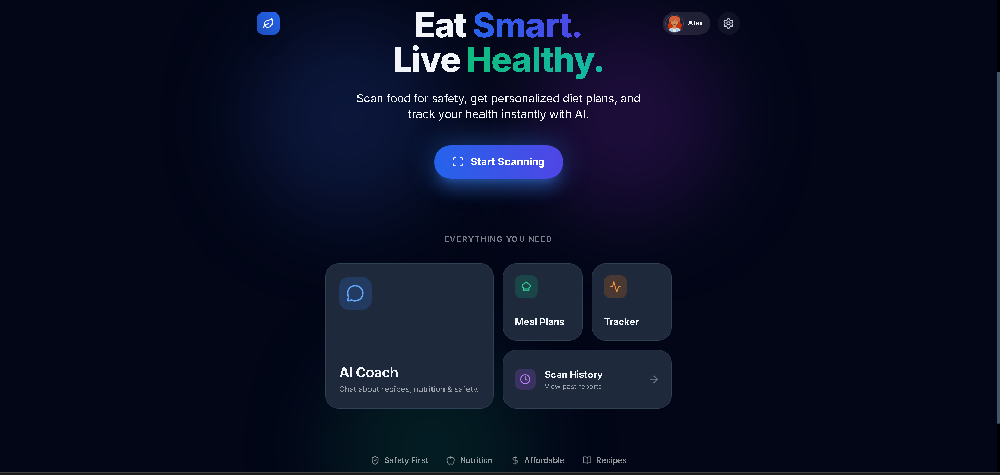
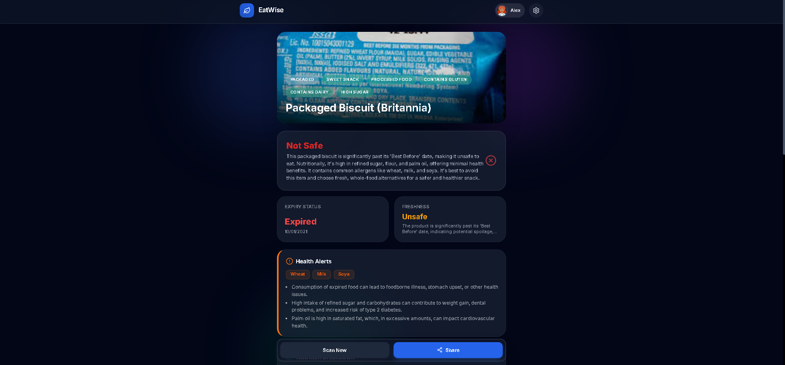
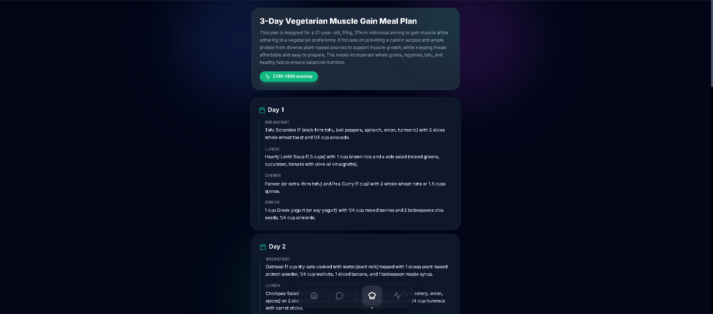
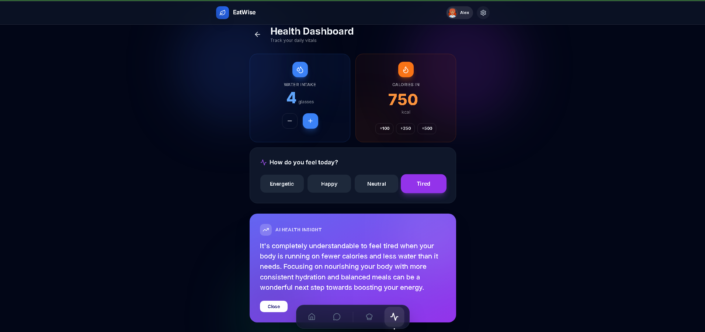
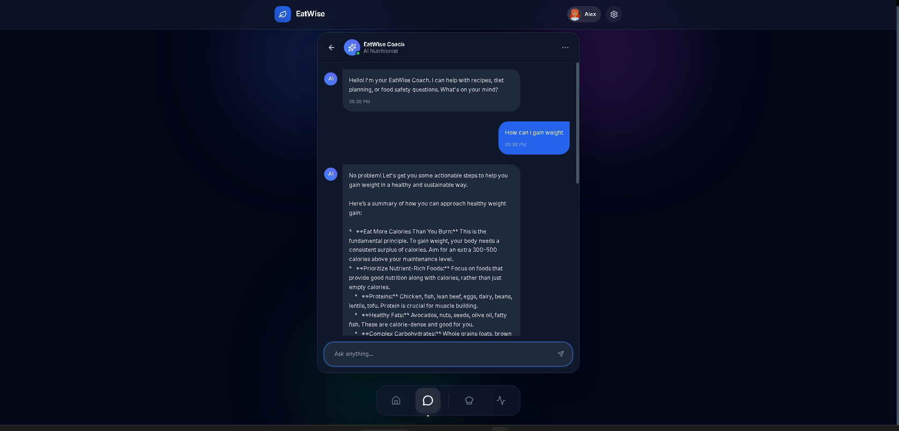

# 🍏 EatWise – AI Food Safety, Nutrition & Health Assistant

[](LICENSE)


---

## 🎯 About EatWise
EatWise is an AI-powered platform that helps you **scan food for safety**, **check expiry**, **analyze nutrition**, generate **personalized diet plans**, and track your **daily health metrics** through a beautiful modern UI. Built using **Gemini 3**, developed with **Vibe Coding in Gemini Studio**, and deployed on **Google Cloud Run**, EatWise is your intelligent everyday food and health companion.

---

## 🚀 Live Demo
👉 **Try the app here:**
https://YOUR_CLOUD_RUN_URL/

---

## 🎥 Demo Preview (GIF)
> *(Add a GIF here once available)*

---

## 🧠 Key Features

### 🔍 AI Food Scanner
- Detects spoilage, expiry, mold, and unhealthy ingredients
- Rates food as **Safe**, **Caution**, or **Unsafe**
- Explains nutrition in simple terms
- Generates personalized alerts based on your health profile

### 🥗 Personalized Diet Planner
- Weekly meal plans generated dynamically by Gemini AI
- Supports weight loss, muscle gain, diabetic-friendly, heart-friendly diets
- Budget-conscious recommendations

### 🤖 AI Chatbot Coach
- Chat instantly about recipes, ingredients, health, fitness & more
- Friendly and conversational

### 📊 Health Dashboard
- Track water intake, calories, mood, and receive daily insights
- AI-generated health tips based on your patterns

### 🕒 Scan History
- Keeps every scan linked to your account
- View past reports with images and timestamps

### 🔐 Authentication
- Secure Google Login
- Private user dashboard with profiles

### 🎨 Beautiful Modern UI
- Glassmorphism & gradient-based cards
- Smooth animations
- Minimalist, intuitive design

---

# 🖼 Screenshots

### 🏠 Home Page


### 🔍 Product Analysis


### 🥗 Diet Planner


### 📊 Health Dashboard


### 🤖 AI Chatbot


---

# 💎 Built With Vibe

EatWise is built using:

- **Gemini Studio – Vibe Coding**
- **Gemini 3 Flash/Pro Models**
- **Google Cloud Run Deployment**
- **Firestore / Supabase for Storage**
- **React + TypeScript + Vite**
- **TailwindCSS for UI**

---

# 🧱 Architecture Overview

```
User
 │
 ▼ Frontend (Vite + React + TypeScript + Tailwind)
 │
 ▼ Gemini AI (Food Safety, Diet Planning, Chatbot)
 │
 ▼ Backend API (Cloud Run)
 │
 ▼ Database (Firestore / Supabase)
```

---

# ⚙️ Installation

### 1. Clone the repo
```
git clone https://github.com/YOUR_USERNAME/EatWise.git
cd EatWise
```

### 2. Install dependencies
```
npm install
```

### 3. Create `.env` file
```
VITE_GEMINI_API_KEY=your_key
VITE_FIREBASE_API_KEY=your_key
VITE_FIREBASE_AUTH_DOMAIN=your_domain
VITE_FIREBASE_PROJECT_ID=your_project
VITE_FIREBASE_STORAGE_BUCKET=your_bucket
VITE_FIREBASE_APP_ID=your_app_id
```

### 4. Run app locally
```
npm run dev
```

### 5. Deploy to Cloud Run
```
gcloud run deploy eatwise \
  --source . \
  --region=YOUR_REGION \
  --allow-unauthenticated
```

---

# 🧩 Folder Structure

```
EatWise/
 ├── MainPage.png
 ├── ProductReview.png
 ├── DietPlanner.png
 ├── HealthManager.png
 ├── Chatbot.png
 ├── App.tsx
 ├── index.tsx
 ├── types.ts
 ├── package.json
 └── README.md
```

---

# 🔮 Future Enhancements
- AI grocery recommendation engine
- Barcode scanning
- Offline model support
- Family/shared profile system
- More health metrics
- Weekly nutrition insights dashboard

---

# 📜 License
MIT License

---

# ❤️ Credits
Built with ❤️ using:
- **Gemini 3**
- **Gemini Studio Vibe**
- **Google Cloud Run**
- **React + Vite**

